# CI Testing Matrix - SoundWave (SoundCloud Clone)

This document describes how the four GitHub Actions workflows in this
repo group fit together. The audit plan that drives every workflow lives
at `/.cursor/plans/e2e_testing_strategy_audit_e82ab5b1.plan.md`.

> The four repos (Frontend, Cross-Platform Flutter, Backend, plus the
> top-level Testing folder for k6) each carry their own CI YAML.
> This file is the index.

## 1. Workflow topology

```mermaid
flowchart TD
    subgraph FE[Frontend - Next.js]
      FE_JEST[jest unit]
      FE_PW_MOCK[playwright mock<br/>NEXT_PUBLIC_USE_MOCK_API=true]
      FE_PW_REAL[playwright real<br/>BACKEND_URL=staging]
    end

    subgraph FL[Cross-Platform - Flutter]
      FL_ANALYZE[flutter analyze]
      FL_UNIT[flutter test]
      FL_INT[flutter test integration_test]
    end

    subgraph BE[Backend - FastAPI]
      BE_LINT[flake8]
      BE_UNIT[pytest tests/unit]
      BE_API[pytest tests/api]
      BE_OPENAPI[OpenAPI snapshot]
    end

    subgraph PERF[Backend Perf - k6]
      PERF_SMOKE[smoke<br/>nightly + on push]
      PERF_LONG[load / stress / spike<br/>soak / streaming / chat<br/>workflow_dispatch only]
    end

    FE_JEST --> RELEASE[Release / merge gate]
    FE_PW_MOCK --> RELEASE
    FE_PW_REAL --> RELEASE
    FL_ANALYZE --> RELEASE
    FL_UNIT --> RELEASE
    FL_INT --> RELEASE
    BE_LINT --> RELEASE
    BE_UNIT --> RELEASE
    BE_API --> RELEASE
    BE_OPENAPI --> RELEASE
    PERF_SMOKE --> RELEASE
    PERF_LONG -. on demand .-> RELEASE
```




Each block above maps to one job in one workflow file. A push to `main`
runs every block except the `PERF_LONG` group, which is gated behind
`workflow_dispatch` because the cheapest long scenario takes 10 minutes
of compute and `soak` takes 2 hours.

## 2. Workflows by file


| Workflow                                                | Owner agent | Scope                                                                                                 |
| ------------------------------------------------------- | ----------- | ----------------------------------------------------------------------------------------------------- |
| `Frontend/.github/workflows/<file>.yml`                 | Frontend    | jest, playwright (mock + real), lint                                                                  |
| `Cross-Platform/.github/workflows/<file>.yml`           | Flutter     | flutter analyze, flutter test, flutter test integration_test                                          |
| `Backend/.github/workflows/backend-ci.yml`              | Backend     | flake8, alembic upgrade head, `pytest tests/unit`, `pytest tests/api`, OpenAPI snapshot, docker build |
| `Backend/.github/workflows/perf-smoke.yml` (this agent) | Perf        | k6 smoke on push + nightly; `workflow_dispatch` for the other six scenarios                           |


The Backend repo carries both the application CI and the perf workflow
because k6 hits backend HTTP. The perf workflow boots the same uvicorn
process the unit/api tests would, then runs k6 against `localhost:8000`,
then uploads the k6 summary as a workflow artifact.

## 3. Required secrets

Some are optional depending on which workflow path is taken. Configure
them at the **org** level if you want them shared across the three
sibling repos.


| Secret                     | Used by                  | Required when                                                                                 |
| -------------------------- | ------------------------ | --------------------------------------------------------------------------------------------- |
| `BACKEND_URL`              | FE Playwright real, Perf | Pointing tests at a deployed staging backend instead of an ephemeral one                      |
| `BACKEND_DATABASE_URL`     | Backend api, Perf seed   | Running migrations + seeding against a non-default Postgres                                   |
| `SECRET_KEY`               | Backend                  | Auth tokens; CI default is `ci-test-secret-key`                                               |
| `GOOGLE_CLIENT_ID`         | Backend                  | `/auth/google` route (CI default is the placeholder `ci-test-google-client-id`)               |
| `VERIFICATION_BACKDOOR`    | Perf, FE Playwright real | Set to `true` if your test backend exposes an email-verification shortcut                     |
| `K6_CLOUD_TOKEN`           | Perf (optional)          | Only when you want k6 cloud streaming (not used by default; k6 runs locally on the GH runner) |
| `PLAYWRIGHT_TEST_BASE_URL` | FE Playwright real       | Override the default localhost when the FE runs against a deployed BE                         |
| `FLUTTER_BACKEND_URL`      | Flutter integration real | `--dart-define=BACKEND_URL=...` for the real-API integration tests                            |


The smoke variant of the perf workflow can run with **no secrets**: it
spins up a fresh Postgres service container, runs `alembic upgrade head`,
boots uvicorn locally, seeds via the existing `scripts/seed_team.py`,
then runs k6 smoke.

## 4. Running each suite locally

### Frontend (Next.js)

```bash
cd Frontend/media
npm install

npm run test                       # jest unit
npm run test:e2e                   # playwright mock (default, NEXT_PUBLIC_USE_MOCK_API=true)
npm run test:e2e:real              # playwright real (project: chromium-real)
```

### Cross-Platform (Flutter)

```bash
cd Cross-Platform
flutter pub get

flutter analyze
flutter test                                      # widget + unit tests
flutter test integration_test                     # mock-backed integration suite
flutter test integration_test/real_api \
  --dart-define=BACKEND_URL=http://localhost:8000 # real-API integration (after P2.4)
```

### Backend (FastAPI)

```bash
cd Backend
python -m venv .venv && source .venv/bin/activate
pip install -r requirements.txt
pip install pytest flake8

flake8 app/

# Unit tests (mocked repos)
pytest tests/unit

# API tests (TestClient; needs DB unless conftest provides in-memory)
pytest tests/api

# OpenAPI snapshot (after STEP 7 P3.5 lands)
pytest tests/api/test_openapi_snapshot.py
```

### Perf (k6 against the backend)

```bash
cd Backend

# Boot backend (one terminal)
uvicorn app.main:app --host 0.0.0.0 --port 8000

# Seed (another terminal)
PYTHONPATH=. python scripts/seed_team.py

# Run scenarios
k6 run tests/perf/scenarios/smoke.js
k6 run --summary-export=load.json tests/perf/scenarios/load.js
k6 run tests/perf/scenarios/stress.js
BACKEND_URL=https://staging.example.com k6 run tests/perf/scenarios/streaming.js
```

See `[Backend/tests/perf/README.md](../Backend/tests/perf/README.md)` for
env vars, scenario thresholds, and full layout.

## 5. Coverage matrix

What each workflow actually verifies. F = full automation, P = partial,
M = missing. Cells map to the audit plan's STEP 4 / STEP 5 sections.


| Capability                             | FE Jest | FE PW Mock | FE PW Real | Flutter Unit | Flutter Integration | BE Unit | BE API | k6 Perf |
| -------------------------------------- | ------- | ---------- | ---------- | ------------ | ------------------- | ------- | ------ | ------- |
| Auth: login / logout (mocked)          | -       | F          | -          | -            | F                   | F       | P      | -       |
| Auth: register -> verify -> login real | -       | -          | P          | -            | M                   | P       | M      | F       |
| Auth: refresh token rotation           | -       | -          | M          | -            | M                   | P       | M      | -       |
| Auth: rate-limit on login storm        | -       | -          | -          | -            | -                   | P       | M      | F       |
| Upload: happy path                     | -       | F          | P          | -            | M                   | -       | F      | P       |
| Upload: validation (size/type)         | -       | P          | M          | -            | M                   | -       | F      | -       |
| Track: GET + Range stream              | -       | -          | P          | -            | M                   | -       | F      | F       |
| Track: record play                     | -       | -          | P          | -            | M                   | -       | F      | F       |
| Search: keyword                        | -       | P          | P          | P            | P                   | -       | F      | F       |
| Profile: view, follow, block           | -       | P          | P          | M            | M                   | -       | F      | P       |
| Playlist CRUD + add tracks             | -       | M          | P          | M            | M                   | -       | F      | P       |
| Likes / reposts / comments             | P       | M          | M          | M            | M                   | F       | *      | P       |
| Notifications list / mark read         | -       | M          | P          | M            | M                   | -       | F      | F       |
| Messaging: conversation + send         | -       | M          | P          | M            | M                   | -       | F      | F       |
| Settings: privacy / username / 2FA     | -       | F          | P          | M            | M                   | -       | P      | -       |
| Navigation stability / modal cycling   | -       | F          | -          | F            | F                   | -       | -      | -       |
| Streaming throughput (Range, bytes/s)  | -       | -          | -          | -            | -                   | -       | -      | F       |
| Chat throughput (msgs/min)             | -       | -          | -          | -            | -                   | -       | -      | F       |
| Soak / memory-stable proxy             | -       | -          | -          | -            | -                   | -       | -      | F       |


`*` = engagement router exists in code but is not mounted in
`app/main.py`. Tests that exercise it are blocked until backend STEP 7
P3.3 lands.

## 6. Notes for sibling agents

- **Frontend** workflow should run jest first, then playwright-mock,
then playwright-real. Playwright-real depends on a reachable
`BACKEND_URL` and should `setup` once with global storage state.
- **Flutter** workflow should split `flutter test` (unit + widget) from
`flutter test integration_test` so a flaky integration test doesn't
hide a unit-level regression.
- **Backend** workflow should keep `tests/unit` fast (pure mocks) and
add `tests/api` once the router test fixtures land. The same workflow
should diff-fail on OpenAPI snapshot drift.
- **Perf** workflow runs `smoke` on every push and nightly. To execute
any of `load / stress / spike / soak / streaming / chat`, manually
trigger via the Actions tab and pick the scenario from the dropdown.

## 7. Where things live

```
SoftwareProject/
  Backend/
    .github/workflows/backend-ci.yml      # unit + api + openapi (Backend agent)
    .github/workflows/perf-smoke.yml      # k6 (this agent)
    tests/perf/                           # k6 project (this agent)
  Frontend/
    .github/workflows/frontend-ci.yml     # jest + playwright (Frontend agent)
  Cross-Platform/
    .github/workflows/flutter-ci.yml      # flutter analyze/test/integration (Flutter agent)
  Testing/
    CI_README.md                          # this file
```

